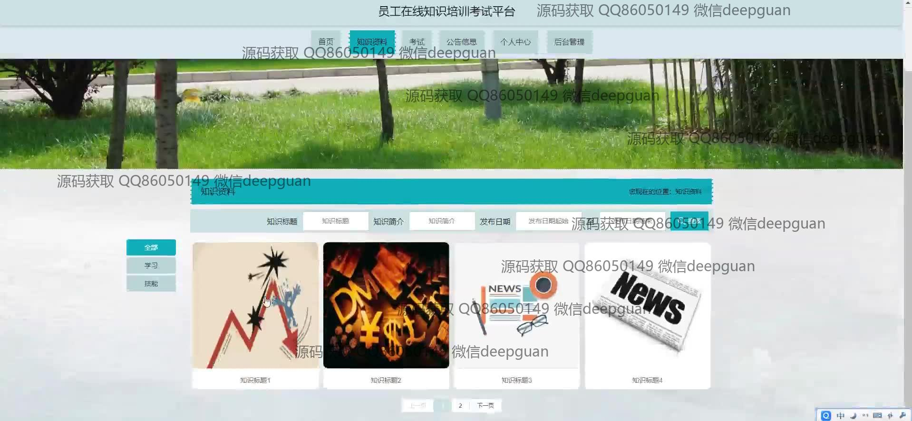
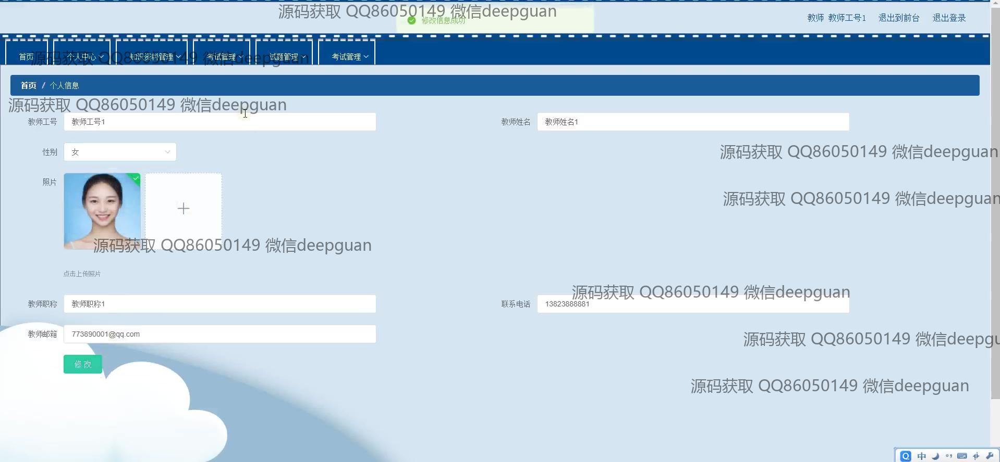
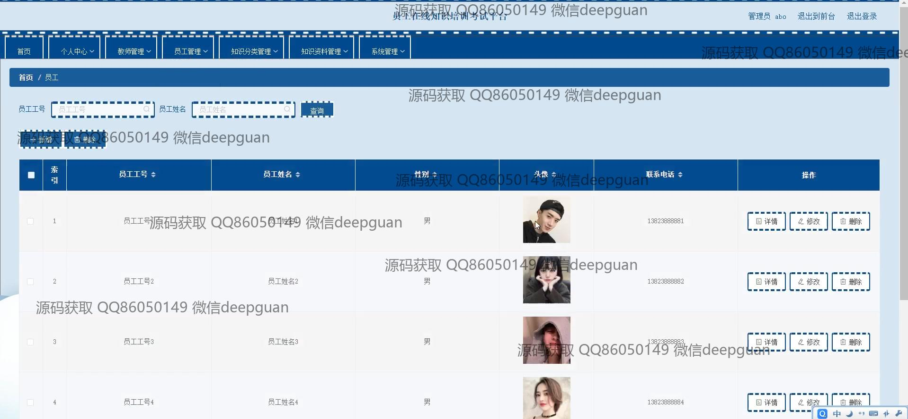

<h1 align="center">员工在线知识培训考试平台</h1>

## 简介
员工在线知识培训考试平台：角色分为教师、管理员和员工；包含在线考试管理、知识资料上传与编辑、公告信息发布、用户信息管理和系统设置等功能模块，旨在提升员工培训与知识管理效率。    --计算机毕业设计源码；毕设源码；java毕业设计源码

## 联系方式

<h3 align="center">获取完整代码与数据库文件 + 微信：deepguan QQ: 86050149 QQ群: 783742310</h3>

<h3 align="center">可帮忙远程部署 包运行成功！提供远程部署、修改代码、设计文档指导、代码讲解等服务！</h3>

## 功能介绍（完整见运行截图）
管理员： 基本功能包括管理系统中的教师和员工信息、知识分类和资料、考试和试题等。可以通过导航栏访问各个模块，如个人中心、教师管理、知识资料管理和系统管理。具备上传和管理知识资料的功能，包括文本、图片、视频的上传，设置资料发布日期，并提供批量操作的选项。考试管理部分包括新增、修改和删除考试，设置考试时间和状态，管理试题及分值，查看考试记录和成绩。

教师： 主要功能是管理和上传知识培训资料，支持多种格式的文件并可指定发布日期。教师还可以创建和管理考试题目，选择题型和设置分值、答案解析等。界面支持通过导航菜单访问个人中心、知识资料及考试信息，还可在个人中心编辑自身信息，如姓名、职称、联系方式等。教师在管理界面中可以查看和修改上传的资料，使用文本编辑器进行格式化编辑。

员工： 用户主页提供个人信息展示和修改功能，包括工号、姓名、性别和联系方式，能上传个人头像。员工可以通过导航栏访问知识资料、公告信息和考试记录等，参与在线考试并查看考试记录和成绩。搜索栏和推荐板块帮助员工快速获取所需的知识资料和最新公告。员工管理界面允许通过工号或姓名查询基本信息，并支持修改、删除操作。

系统用户： 所有角色需在平台登录页面输入用户名和密码并选择角色身份进入，系统登录页面设计简洁而富有学习氛围。通过首页导航栏可以访问不同模块，获取公告信息、知识资源、考试信息等，通过个人中心管理个人资料。知识资料界面提供分类、搜索及筛选功能，便于用户查询和管理资源。整体界面设计以提供高效、便捷的在线培训和考试体验为目标。

## 运行截图

本代码来源于网络,仅供学习参考使用!

